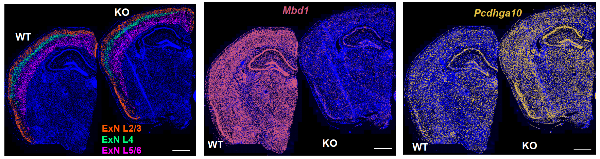
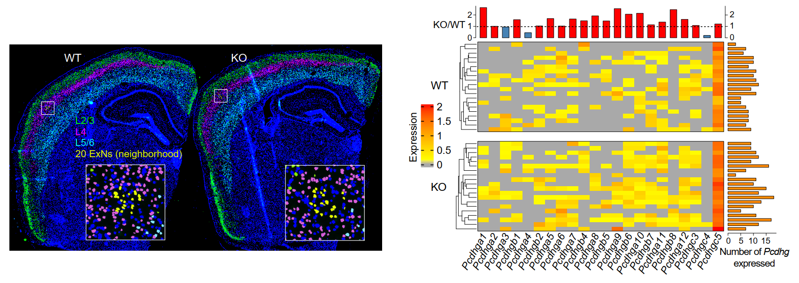

# Spatial Regulation of Protocadherins in Mouse Cortex 
### MERFISH-based spatial transcriptomic analysis of protocadherin gene expression in mouse cortex (WT vs KO Mouse Cortex)

<p align="center">
  
</p>

<p align="center">
  
</p>

---

## Overview

This repository contains analysis pipelines for MERFISH spatial transcriptomics data comparing **WT vs KO** in mouse cortex.

The workflow includes:
- MERFISH data QC and preprocessing
- Clustering gene expression and cell type annotation
- Cortical layer-wise analysis
- Protocadherin (Pcdh) expression and similarity analysis

---

## Dependencies

These analyses were performed using:

**R environment**
- R version: 4.4.1  
- Platform: x86_64-w64-mingw32 (Windows 11 Pro)

**Python environment**
- Ubuntu 22.04.5 LTS  
- For installation:

```bash
conda create -n STenv python=3.10 scanpy=1.10.1 squidpy=1.2.2 -c conda-forge -y
conda activate STenv
```
---

### Main R packages
Seurat_5.4.0, SeuratObject_5.3.0, harmony, dplyr_1.1.4, ggplot2_4.0.2, patchwork_1.3.2, Matrix_1.7-1, FNN_1.1.4.1, SeuratWrappers_0.3.2
- For installation
```r
install.packages("remotes")
remotes::install_version("Seurat", version = "5.4.0")
remotes::install_version("SeuratObject", version = "5.3.0")
remotes::install_version("dplyr", version = "1.1.4")
remotes::install_version("ggplot2", version = "4.0.2")
remotes::install_version("patchwork", version = "1.3.2")
remotes::install_version("Matrix", version = "1.7-1")
remotes::install_version("FNN", version = "1.1.4.1")
install.packages("harmony")
remotes::install_github("satijalab/seurat-wrappers@v0.3.2")
```
---

### Other tools
- locator() (base R) for manual spatial layer annotation  

---

## Main Scripts

QC_&_filtering.py  
: Quality control and filtering of MERFISH data  

integrate_&_get_DEG_removed_clusters.R  
: Normalization, integration (Harmony), clustering, and UMAP generation  

get_celltype_annotations.R  
: Cell type marker-based annotation of clusters  

get_cortical_layer_anchor_points.R  
: Manual cortical layer tracing and anchor point generation  

anchor_neighborhood_cells_#Pcdh_genes_expressed.R  
: Extraction of neighboring cells and number of Pcdh genes expressed in neighborhood cells  

anchor_neighborhood_cells_get_Jaccard_index_for_Pcdh.R  
: Binarized Pcdh gene expression similarity analysis (Jaccard index) in neighborhood cells  

anchor_neighborhood_cells_Pcdh_Spearman_correlation.R  
: Spearman correlation of Pcdh gene expression in neighborhood cells   

---

## Data Access

The dataset is available upon request to the reviewers

## Contact

For questions, please contact:  
Pubudu Kumarage (pkumarage@wisc.edu), Yu Gao (yu.gao@wisc.edu), Xinyu Zhao (xinyu.zhao@wisc.edu)
